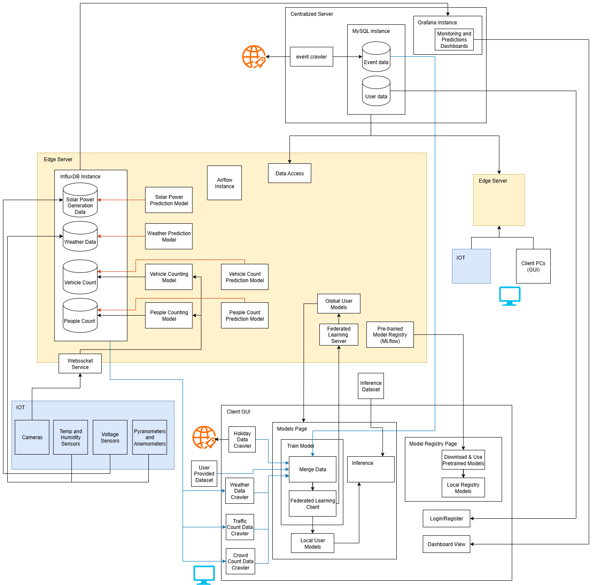

<p align="center">
  
</p>

### Useful Info

#### grafana

```
username: admin
pword: fyp12345
```

#### influxdb username: navod

```
username: navod
pword: fyp12345
organization: fyp
token: 3wvWUxmtdBM03hm9YgTEa91s6ofQ73G4gQ54uNR0Ek59zpJNMGOagj1UR1GKw3D1f5Elw-zS78rEwY7akZGmOw==
```

#### Access MLflow ui

```
url:http://localhost:5001/
```

### Run The Simulation

#### 1. build airflow image with packages  
```
cd edge_server/airflow_env
docker build . --tag extended_airflow:latest
```

#### 2. initialize airflow  
in project root
```
docker compose up airflow-init
```

#### 3. start influxdb, grafana, MLflow, MySQL services
in project root
```
docker-compose up -d
```

#### 4. ingest models to MLflow

run temp python files in mlflow folder

#### 5. start central server

```
cd central_server
uvicorn api:app --host 0.0.0.0 --port 8000 --reload
```

#### 6. ingest events

```
cd central_server/event_ingester
python events_ingest.py
```

#### 7. start edge server

```
cd edge_server
uvicorn api:app --host 0.0.0.0 --port 8001 --reload
```

#### 8. start common_cameras

```
cd sensors/common_cameras
python camera.py
```

#### 9. start power plants

```
cd sensors/power_plants
python plants.py
```

#### 10. start traffic cameras

```
cd sensors/traffic_cameras
python camera.py
```

#### 11. start weather data stream

```
cd sensors/weather_sensors
python weather_stream.py
```

#### 12. start realtime solar power prediction
```
cd edge_server/power_gen_pred
python realtime_pred.py
```

#### 13. start realtime weather prediction
```
cd edge_server/weather_pred
python realtime_pred.py
```

#### 14. start realtime traffic prediction
```
cd edge_server/traffic_pred
python traffic_pred.py
```

#### 15. start realtime crowd prediction
```
cd edge_server/crowd_pred
python crowd_pred.py
```

#### 16. run local web app:

```
cd desktop_app
streamlit run app.py
```

login creds:
```
username: navod
password: navod123
``
